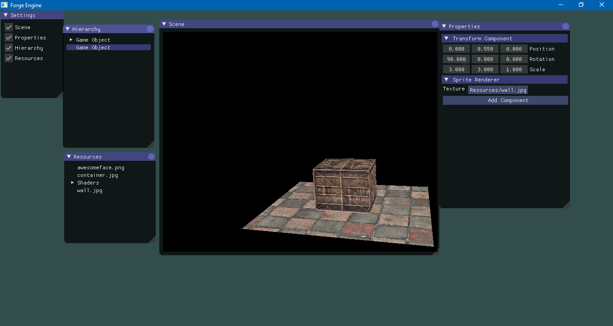

# Forge engine(WIP)
Simple 2D and 3D game engine created for educational purporses.

## Features:
- OpenGL rendering
- Window creation
- Input processing
- Event system
- Math library
- Entity-component system
- Platform independent layer

## Planed Features:
- Deferred Rendering
- DirectX implementation
- Android support
- Linux support
- Job system
- Lua scripting
- C# scripting
- Prefab system

Editor screenshot:

